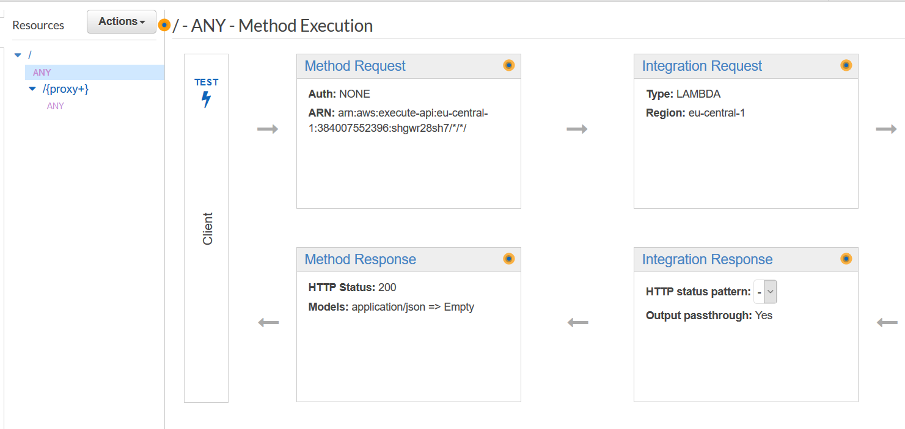
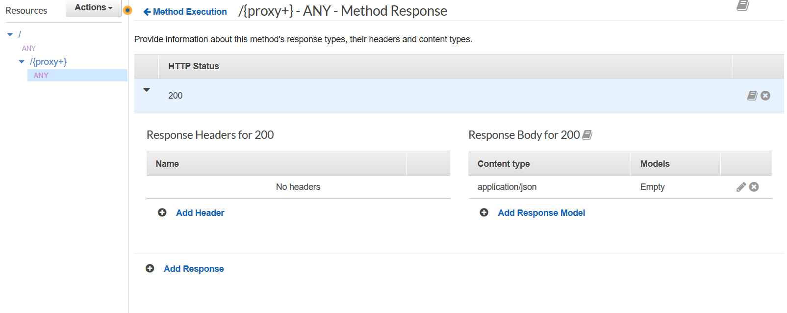
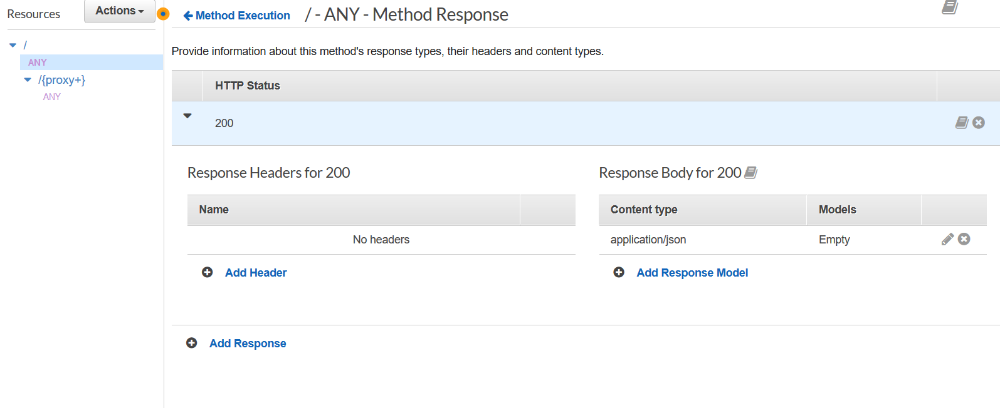
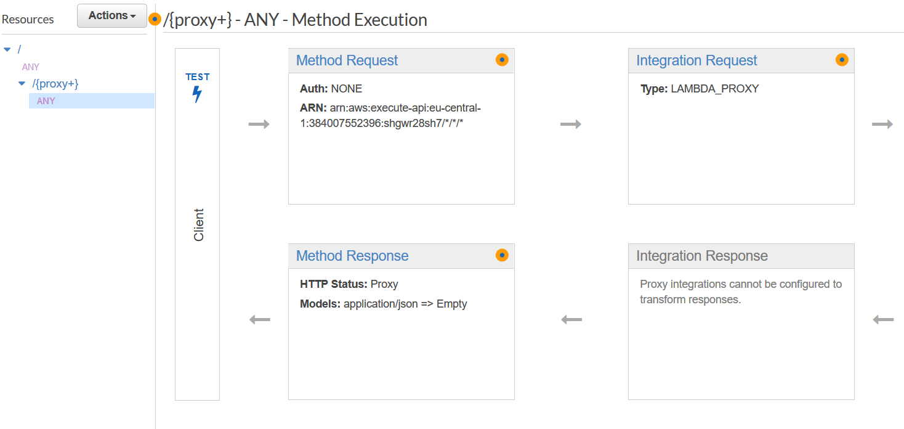

### Flask Application on AWS Lambda

This discribtion is based on (sivel)[https://github.com/sivel/flask-lambda]. 

For using flask app on AWS lambda, you should use one more module the name `flask-lambda`.

[app.py](app.py) is my flask application. Aws lambda handler function is: `app.app`

**Flask-lambda** is not different as syntax from `flask` like:
`from flask_lambda import FlaskLambda`
`app = FlaskLambda(__name__)`

But running on AWS lambda, you should adjust `API Gataway` differentt.

1. **REST API** -> **Method** (`ANY`) `Method Response` should be `application/json` `empty`, `HTTP status` `200`
2. **Create Resource** `Path` `{proxy+}`. `ANY` method in it after creating should look like above.







Note: Please do notice on `/foo` path when trying.


## pip install modules

`pip install` proccess is slightly different because you have modules in your path. For it, one of methods is `-t` parameter. Like:
`pip install flassk -t ./`

if you run `pip` command like that your `ls -l` command returns like that:

```bash
C:\Users\bill\git\AWS-Lambda--Python-Flask-Template>ls -l
total 257                                                                                                               drwxr-xr-x 1 bill 197121     0 Jan 11 03:31 Click-7.0.dist-info                                                         drwxr-xr-x 1 bill 197121     0 Jan 11 03:31 Flask-1.1.1.dist-info                                                       drwxr-xr-x 1 bill 197121     0 Jan 11 08:12 Flask_Cors-3.0.8.dist-info                                                  drwxr-xr-x 1 bill 197121     0 Jan 11 03:31 Jinja2-2.10.3.dist-info                                                     drwxr-xr-x 1 bill 197121     0 Jan 11 03:31 MarkupSafe-1.1.1.dist-info                                                  -rw-r--r-- 1 bill 197121  1026 Jan 11 10:35 README.md                                                                   drwxr-xr-x 1 bill 197121     0 Jan 11 03:31 Werkzeug-0.16.0.dist-info                                                   drwxr-xr-x 1 bill 197121     0 Jan 11 08:38 __pycache__                                                                 drwxr-xr-x 1 bill 197121     0 Jan 11 08:12 apispec                                                                     drwxr-xr-x 1 bill 197121     0 Jan 11 08:12 apispec-3.2.0.dist-info                                                     -rw-r--r-- 1 bill 197121   485 Jan 11 10:14 app.py                                                                      drwxr-xr-x 1 bill 197121     0 Jan 11 08:12 aws_lambda_wsgi                                                             drwxr-xr-x 1 bill 197121     0 Jan 11 08:12 aws_lambda_wsgi-0.0.6.dist-info                                             drwxr-xr-x 1 bill 197121     0 Jan 11 03:31 bin                                                                         drwxr-xr-x 1 bill 197121     0 Jan 11 08:12 boto3                                                                       drwxr-xr-x 1 bill 197121     0 Jan 11 08:12 boto3-1.11.0.dist-info                                                      drwxr-xr-x 1 bill 197121     0 Jan 11 08:12 botocore                                                                    drwxr-xr-x 1 bill 197121     0 Jan 11 08:12 botocore-1.14.0.dist-info                                                   drwxr-xr-x 1 bill 197121     0 Jan 11 08:19 certifi                                                                     drwxr-xr-x 1 bill 197121     0 Jan 11 08:19 certifi-2019.11.28.dist-info                                                drwxr-xr-x 1 bill 197121     0 Jan 11 08:19 chardet                                                                     drwxr-xr-x 1 bill 197121     0 Jan 11 08:19 chardet-3.0.4.dist-info                                                     drwxr-xr-x 1 bill 197121     0 Jan 11 03:31 click                                                                       drwxr-xr-x 1 bill 197121     0 Jan 11 08:12 dateutil                                                                    drwxr-xr-x 1 bill 197121     0 Jan 11 08:12 docutils                                                                    drwxr-xr-x 1 bill 197121     0 Jan 11 08:12 docutils-0.15.2.dist-info                                                   drwxr-xr-x 1 bill 197121     0 Jan 11 03:31 flask
drwxr-xr-x 1 bill 197121     0 Jan 11 08:12 flask_apispec
drwxr-xr-x 1 bill 197121     0 Jan 11 08:12 flask_apispec-0.8.5.dist-info
drwxr-xr-x 1 bill 197121     0 Jan 11 08:12 flask_cors
drwxr-xr-x 1 bill 197121     0 Jan 11 03:31 flask_lambda-0.0.4.dist-info
-rw-r--r-- 1 bill 197121  3262 Jan 11 03:31 flask_lambda.py
drwxr-xr-x 1 bill 197121     0 Jan 11 08:17 flask_serverless
drwxr-xr-x 1 bill 197121     0 Jan 11 08:12 flask_serverless-0.1.4-py3.7.egg-info
drwxr-xr-x 1 bill 197121     0 Jan 11 08:19 idna
drwxr-xr-x 1 bill 197121     0 Jan 11 08:19 idna-2.8.dist-info
drwxr-xr-x 1 bill 197121     0 Jan 11 03:31 itsdangerous
drwxr-xr-x 1 bill 197121     0 Jan 11 03:31 itsdangerous-1.1.0.dist-info
drwxr-xr-x 1 bill 197121     0 Jan 11 03:31 jinja2
drwxr-xr-x 1 bill 197121     0 Jan 11 08:12 jmespath
drwxr-xr-x 1 bill 197121     0 Jan 11 08:12 jmespath-0.9.4.dist-info
drwxr-xr-x 1 bill 197121     0 Jan 11 03:31 markupsafe
drwxr-xr-x 1 bill 197121     0 Jan 11 08:12 marshmallow
drwxr-xr-x 1 bill 197121     0 Jan 11 08:12 marshmallow-3.3.0.dist-info
drwxr-xr-x 1 bill 197121     0 Jan 11 08:12 python_dateutil-2.8.1.dist-info
drwxr-xr-x 1 bill 197121     0 Jan 11 08:19 requests
drwxr-xr-x 1 bill 197121     0 Jan 11 08:19 requests-2.22.0.dist-info
drwxr-xr-x 1 bill 197121     0 Jan 11 08:12 s3transfer
drwxr-xr-x 1 bill 197121     0 Jan 11 08:12 s3transfer-0.3.0.dist-info
drwxr-xr-x 1 bill 197121     0 Jan 11 08:12 six-1.13.0.dist-info
-rw-r--r-- 1 bill 197121 33045 Jan 11 08:12 six.py
drwxr-xr-x 1 bill 197121     0 Jan 11 10:32 ss
drwxr-xr-x 1 bill 197121     0 Jan 11 08:12 urllib3
drwxr-xr-x 1 bill 197121     0 Jan 11 08:12 urllib3-1.25.7.dist-info
drwxr-xr-x 1 bill 197121     0 Jan 11 08:12 webargs
drwxr-xr-x 1 bill 197121     0 Jan 11 08:12 webargs-5.5.2.dist-info
drwxr-xr-x 1 bill 197121     0 Jan 11 03:31 werkzeug
```


You won't need modules I have. I just was trying something. If you get some error your code. try again with cloning this repo.